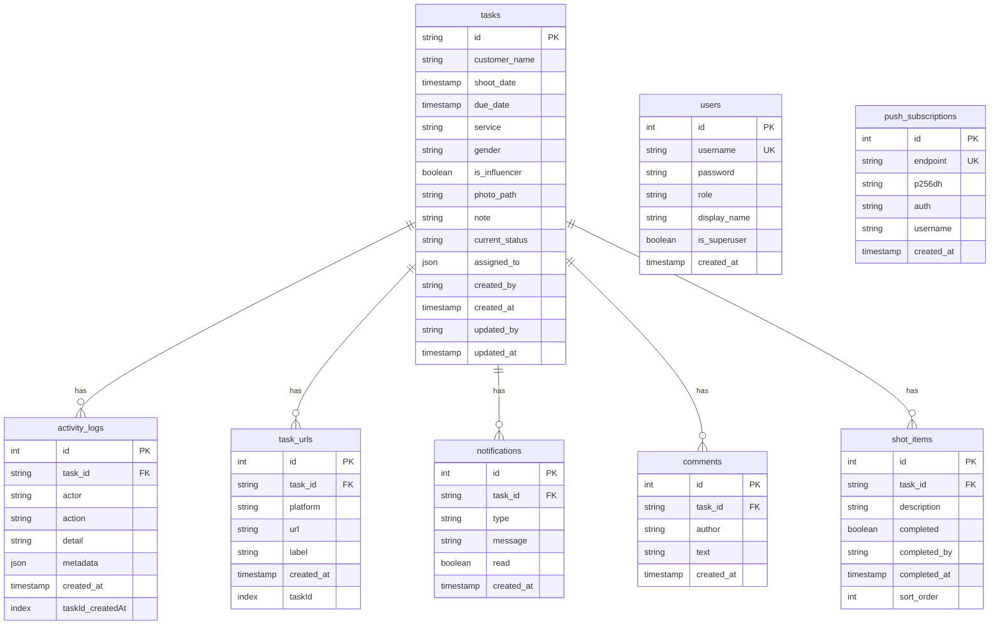

# Database Schema

**Database:** PostgreSQL 15  
**ORM:** Prisma 6.x  
**Tables:** 8

---

## tasks

Main task table. One row per video production task.

| Column | Type | Required | Notes |
|--------|------|:--------:|-------|
| `id` | VARCHAR | ✅ | Primary key. Format: `SHANUZZ-0001` |
| `customer_name` | VARCHAR | ✅ | Customer/client name |
| `shoot_date` | TIMESTAMP | ✅ | Date of video shoot |
| `due_date` | TIMESTAMP | ✅ | Deadline for completion |
| `service` | VARCHAR | ✅ | Service type (enum list) |
| `gender` | VARCHAR | ✅ | Male/Female/Other |
| `is_influencer` | BOOLEAN | - | Default false |
| `photo_path` | VARCHAR | - | Path to uploaded photo |
| `note` | TEXT | - | Free text notes |
| `current_status` | VARCHAR | ✅ | Default "New". Workflow pipeline |
| `assigned_to` | JSONB | ✅ | Default `[]`. Array of usernames |
| `created_by` | VARCHAR | ✅ | Username of creator |
| `created_at` | TIMESTAMP | ✅ | Auto-generated |
| `updated_by` | VARCHAR | - | Username of last updater |
| `updated_at` | TIMESTAMP | - | Last update timestamp |

**Status values:** New, Video Shot, Data Copied, Video Edited, Reviewed, Uploaded, Task Completed

---

## users

| Column | Type | Required | Notes |
|--------|------|:--------:|-------|
| `id` | SERIAL | ✅ | Auto-increment |
| `username` | VARCHAR | ✅ | Unique |
| `password` | VARCHAR | ✅ | bcrypt hash |
| `role` | VARCHAR | ✅ | `su`, `admin`, or `staff` |
| `display_name` | VARCHAR | - | Display name in header |
| `is_superuser` | BOOLEAN | - | Protection flag |
| `created_at` | TIMESTAMP | ✅ | Auto-generated |

**Roles:**
- `su` — Superuser, locked from frontend, full access
- `admin` — Full CRUD, user management
- `staff` — Create tasks, forward-only status updates

---

## activity_logs

Immutable audit trail of all task changes. Created on every PUT, POST (url), or status update.

| Column | Type | Required | Notes |
|--------|------|:--------:|-------|
| `id` | SERIAL | ✅ | Auto-increment, Primary key |
| `task_id` | VARCHAR | ✅ | FK → tasks.id (CASCADE) |
| `actor` | VARCHAR | ✅ | Username who performed the action |
| `action` | VARCHAR | ✅ | `status_change`, `field_update`, `created`, `photo_added`, `photo_removed` |
| `detail` | VARCHAR | ✅ | Human-readable description (e.g. "Status: New → Video Shot") |
| `metadata` | JSONB | - | Arbitrary structured data (old/new values, list of changed fields) |
| `created_at` | TIMESTAMP | ✅ | Auto-generated |

**Index:** `(task_id, created_at)` — covers the primary query pattern (fetch all activities for a task, newest first).

---

## task_urls

Platform URLs attached to completed tasks. Populated during Uploaded → Task Completed via the URL collector modal.

| Column | Type | Required | Notes |
|--------|------|:--------:|-------|
| `id` | SERIAL | ✅ | Auto-increment, Primary key |
| `task_id` | VARCHAR | ✅ | FK → tasks.id (CASCADE) |
| `platform` | VARCHAR | ✅ | `Instagram`, `YouTube Shorts`, `YouTube`, `Snapchat`, `Facebook`, `Google Business Profile`, `Custom` |
| `url` | VARCHAR | ✅ | The actual URL |
| `label` | VARCHAR | - | Custom label when platform = `Custom` |
| `created_at` | TIMESTAMP | ✅ | Auto-generated |

**Index:** `(task_id)` — fast lookup when fetching URLs for a task.

---

## notifications

| Column | Type | Required | Notes |
|--------|------|:--------:|-------|
| `id` | SERIAL | ✅ | Auto-increment |
| `task_id` | VARCHAR | ✅ | FK → tasks.id (CASCADE) |
| `type` | VARCHAR | ✅ | `status_update`, `ping_admin`, `comment` |
| `message` | VARCHAR | ✅ | Human-readable notification |
| `read` | BOOLEAN | - | Default false |
| `created_at` | TIMESTAMP | ✅ | Auto-generated |

---

## comments

| Column | Type | Required | Notes |
|--------|------|:--------:|-------|
| `id` | SERIAL | ✅ | Auto-increment |
| `task_id` | VARCHAR | ✅ | FK → tasks.id (CASCADE) |
| `author` | VARCHAR | ✅ | Username |
| `text` | VARCHAR | ✅ | Comment text |
| `created_at` | TIMESTAMP | ✅ | Auto-generated |

---

## shot_items

| Column | Type | Required | Notes |
|--------|------|:--------:|-------|
| `id` | SERIAL | ✅ | Auto-increment |
| `task_id` | VARCHAR | ✅ | FK → tasks.id (CASCADE) |
| `description` | VARCHAR | ✅ | Shot description |
| `completed` | BOOLEAN | - | Default false |
| `completed_by` | VARCHAR | - | Username who checked it |
| `completed_at` | TIMESTAMP | - | When checked |
| `sort_order` | INT | - | Default 0, for ordering |

---

## push_subscriptions

| Column | Type | Required | Notes |
|--------|------|:--------:|-------|
| `id` | SERIAL | ✅ | Auto-increment |
| `endpoint` | VARCHAR | ✅ | Unique, browser push endpoint |
| `p256dh` | VARCHAR | ✅ | Encryption key |
| `auth` | VARCHAR | ✅ | Auth secret |
| `username` | VARCHAR | ✅ | Associated user |
| `created_at` | TIMESTAMP | ✅ | Auto-generated |

---

## Indexes & Relationships

All child tables use `ON DELETE CASCADE` — deleting a task removes all related records (activity_logs, task_urls, notifications, comments, and shot items).
